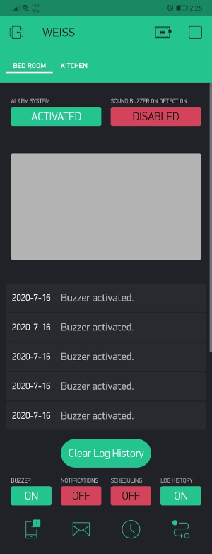

# Wireless Easy Install Security System (WEISS)
A user-friendly and simple to install WiFi security system. Monitor doors, windows and hallways with wireless motion/magnetic sensors and surveillance cameras. The user arms the system using the WEISS mobile app. Users receive email and push notifications with a snapshot from the camera when any of the sensors are tripped.

The mobile app and server were developed using the Blynk IoT platform.

*This project was created during the Summer of 2020 semester for the TPJ-655 course at [Seneca College](https://www.senecacollege.ca).*

## Developers
- [Foster Hangdaan](http://www.fosterhangdaan.com)
- [Brian Kong](https://www.linkedin.com/in/brian-kong-84a21a1bb)

## Functional Diagram

The users interact with WEISS using the Blynk mobile app and the fingerprint scanner. The home router mediates communication between the sensors and Blynk Server. The Blynk server is the central processing unit. It processes the data from the various devices: data from the sensors, video footage from the cameras, mobile app's input/output and fingerprint authentication from the fingerprint scanner. For the best performance, the Blynk server is connected to the home router via ethernet cable.

## Components

| Name | Description |
| ---- | ----------- |
| Magnetic Reed Switch | For monitoring doors and windows. Comprises of two parts: a magnetic-sensitive switch and a magnet. |
| Passive Infrared Switch | For monitoring narrow chokepoints such as hallways. Effective up to 7 metres. |
| Piezzo Buzzer | Sounds an audible alarm when any of the sensors are tripped. |
| Wyze Cam V2 | For video surveillance recording of an area. Email notifications include screenshots from the camera. |
| Raspberry Pi 3 B+ | The brain of the system since it houses the Blynk Server. Data from the sensors and authentication from the fingerprint scanner is processed here. |
| Fingerprint Scanner | Authenticates the user and is used to manually enable or disable the security system. |

### Internal Circuitry of Sensors

The sensor devices are composed of 3 basic parts: a 9V battery, a voltage regulator circuit and a NodeMCU ESP8266. WiFi connection was achieved through the ESP8266 module. The sensors and battery connected to the ESP8266 pins via the voltage regulator circuit. The cases were designed in SolidWorks and then 3D printed.

## Mobile App
<table>
  <tr>
    <td></td>
    <td></td>
  </tr>
</table>

## Resources
- [NodeMCU ESP8266 Firmware](https://github.com/nodemcu/nodemcu-firmware)
- [Wyze Cam Custom Firmware and Bootloader](https://github.com/EliasKotlyar/Xiaomi-Dafang-Hacks)
